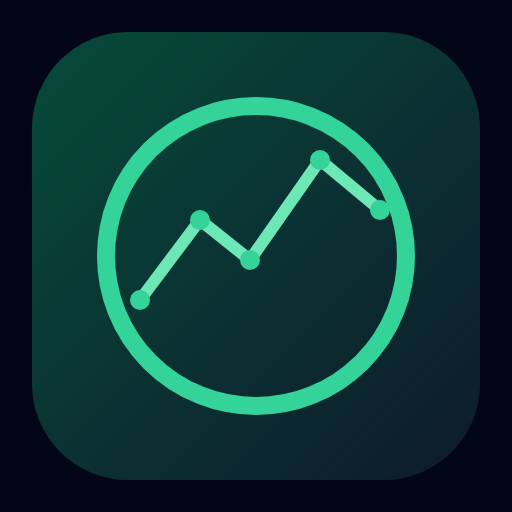
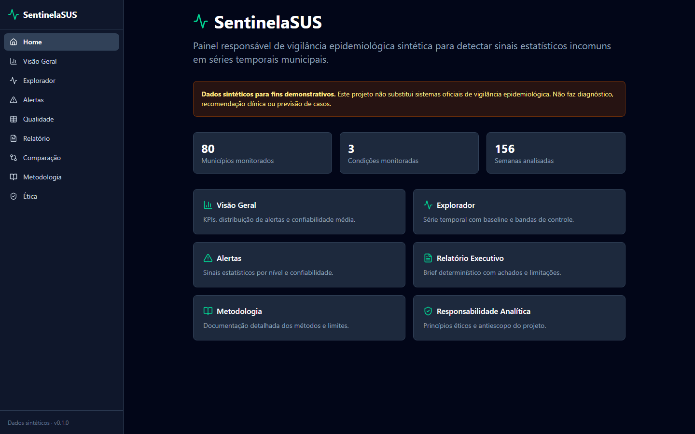
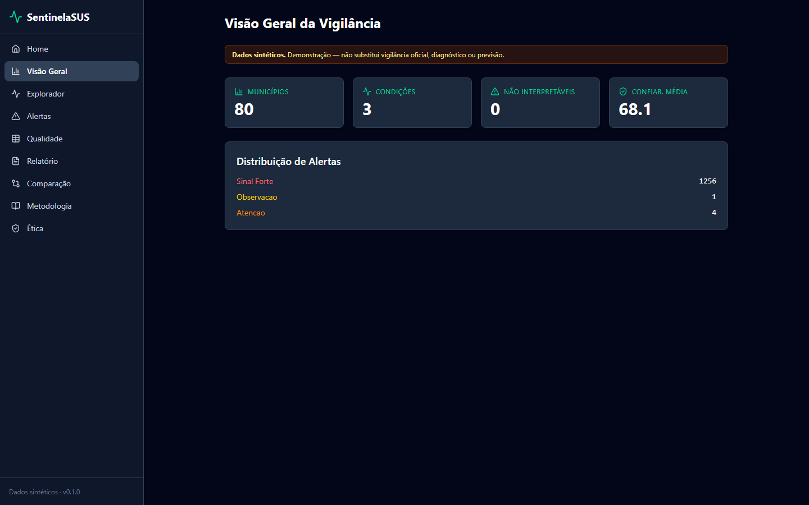
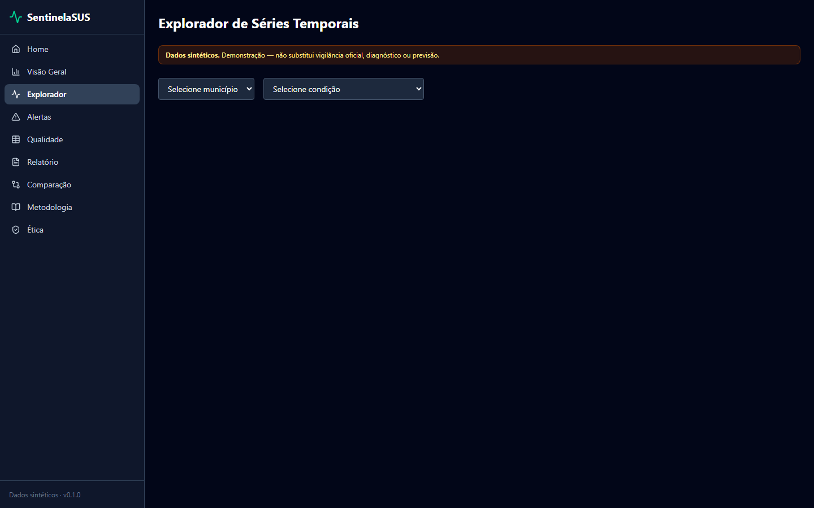
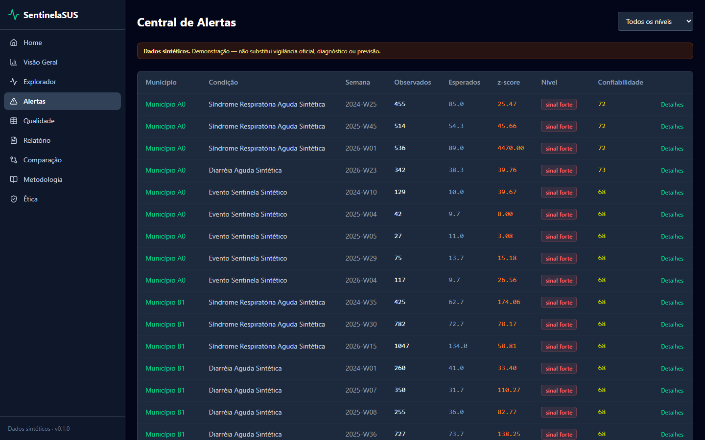
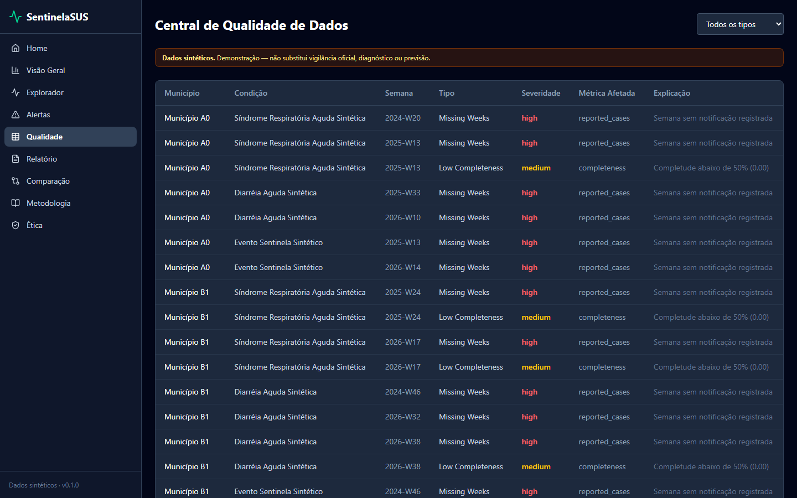
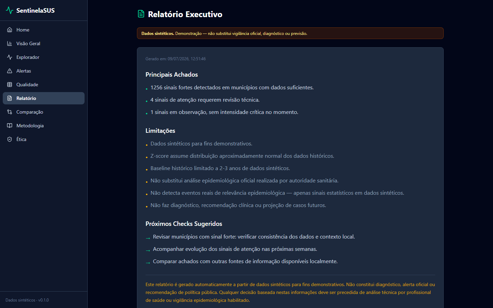
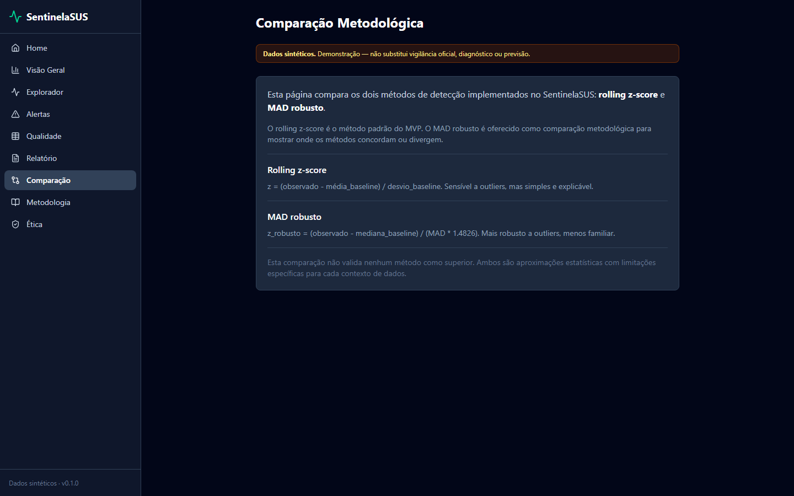
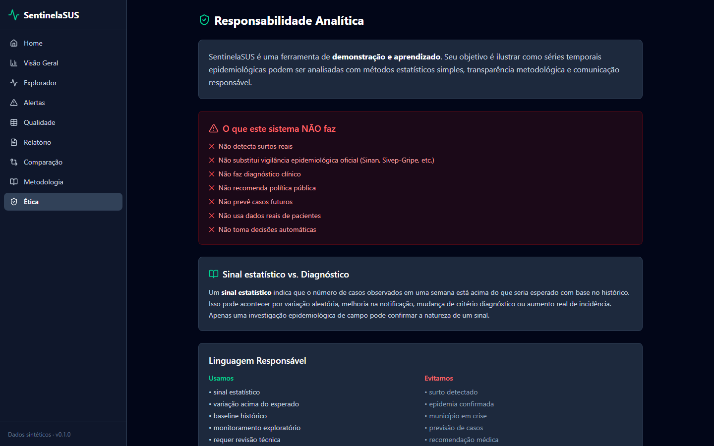
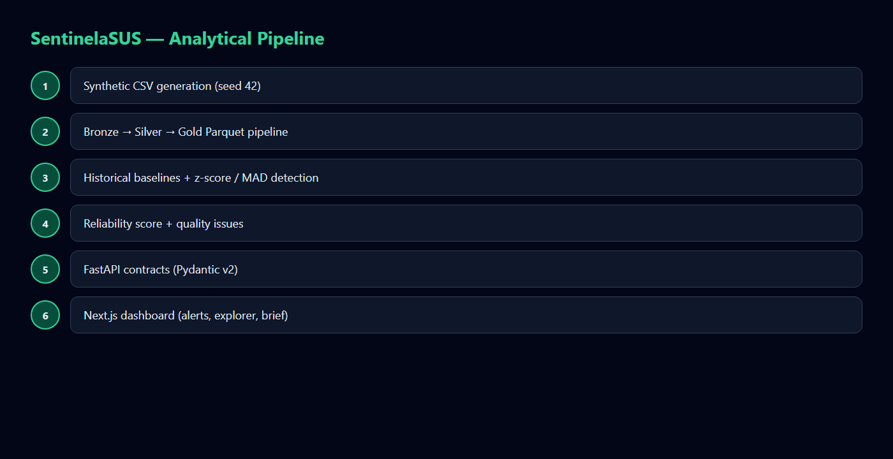

<div align="center">
  

  <h1>SentinelaSUS</h1>

  <p><strong>Painel responsável de vigilância epidemiológica sintética com sinais estatísticos interpretáveis.</strong></p>
  <p><strong>Responsible synthetic epidemiological surveillance with interpretable statistical signals.</strong></p>

  <p>
    <a href="#1-visão-geral--overview">PT-BR / English Overview</a> •
    <a href="#-product-preview">Preview</a> •
    <a href="#-screenshots">Screenshots</a> •
    <a href="#️-stack--tecnologias">Stack</a> •
    <a href="#-arquitetura--architecture">Architecture</a> •
    <a href="#-quick-start--início-rápido">Quick Start</a> •
    <a href="#-autor--author">Author</a>
  </p>

  <p>
    <a href="https://sentinelasus.vercel.app"><strong>🌐 Live Demo</strong></a> •
    <a href="https://sentinelasus-api.vercel.app/health"><strong>🩺 API Health</strong></a> •
    <a href="https://sentinelasus-api.vercel.app/docs"><strong>📚 API Docs</strong></a>
  </p>

  <p>
    
    
    
    
    
    
  </p>
</div>

<p align="center">
  
</p>

---

## 1. Visão Geral / Overview

O **SentinelaSUS** é um painel de vigilância epidemiológica **100% sintética** que transforma séries temporais municipais em sinais estatísticos interpretáveis — com z-score, MAD robusto, reliability score, alertas responsáveis e limites explícitos.

Ele foi desenhado para demonstrar como um produto analítico pode comunicar **incerteza**, **qualidade do dado** e **não-alarmismo** em um domínio sensível de saúde pública, sem usar dados reais, sem diagnóstico clínico e sem previsão de casos.

O projeto foi desenvolvido por **Felipe Alirio Baruja** como peça de portfólio full-stack + analytics engineering, com backend FastAPI, pipeline bronze/silver/gold e frontend Next.js.

> **Responsible Analytics Notice**  
> O SentinelaSUS usa **dados sintéticos** para fins demonstrativos. Ele **não** substitui vigilância epidemiológica oficial, **não** faz diagnóstico, **não** faz previsão e **não** deve ser usado como alerta oficial.

---

## ✨ Product Preview

<p align="center">
  
</p>

O SentinelaSUS apresenta uma experiência dark focada em vigilância responsável: KPIs agregados, distribuição de alertas, confiabilidade média, explorador de séries, central de qualidade e brief executivo determinístico.

---

## 2. Por que este projeto importa? / Why this project matters

* **Dashboards tradicionais mostram números, não incerteza:** séries epidemiológicas são ruidosas, atrasadas e incompletas. Sem baseline e reliability, o risco de interpretação alarmista cresce.
* **Estatística precisa ser explicável:** o SentinelaSUS combina z-score sazonal (mesma semana epidemiológica) e MAD robusto, com thresholds explícitos e score de confiabilidade 0–100.
* **Responsible Analytics em domínio sensível:** linguagem não-alarmista, termos proibidos bloqueados no brief, aviso de dados sintéticos em todas as telas críticas.
* **Produto demonstrável, não notebook:** pipeline reproduzível (seed 42), API tipada, UI consumindo contratos Pydantic e demo pública na Vercel.

---

## 🧠 O diferencial do SentinelaSUS / What makes SentinelaSUS different

### Português
O SentinelaSUS não é apenas um gráfico de casos. Ele combina detecção estatística, qualidade de dados e governança de linguagem em uma experiência rastreável.

Ele mostra não apenas o sinal, mas também:
- quão confiável a série está;
- se o baseline histórico é suficiente;
- quais problemas de qualidade afetam a leitura;
- quais níveis de alerta foram atribuídos e por quê;
- onde a interpretação deve ser limitada;
- que os dados são sintéticos e não oficiais.

### English
SentinelaSUS is not just a case chart. It combines statistical detection, data quality and language governance into one traceable experience.

It shows not only the signal, but also:
- how reliable the series is;
- whether the historical baseline is sufficient;
- which quality issues affect interpretation;
- which alert levels were assigned and why;
- where interpretation must be limited;
- that the data is synthetic and non-official.

---

## 🎯 Problema que resolve / The problem it solves

Em fluxos reais de vigilância agregada, equipes enfrentam:
- séries ruidosas com sazonalidade e subnotificação;
- atraso de notificação e completude irregular;
- ausência de baseline histórico claro;
- alertas sem explicação metodológica;
- dashboards que exibem números sem comunicar incerteza;
- risco de linguagem alarmista (“surto”, “epidemia”, “emergência”).

O **SentinelaSUS** cria uma camada responsável entre a série temporal sintética e a interpretação analítica final.

---

## 🧩 Proposta / Analytical Pipeline

```txt
Synthetic weekly observations (seed 42)
  ↓
Bronze → Silver → Gold Parquet pipeline
  ↓
Historical baselines (mean / std / median / MAD)
  ↓
Rolling z-score + MAD robust detection
  ↓
Alert levels + reliability score (0–100)
  ↓
Quality issues register
  ↓
FastAPI contracts (Pydantic v2)
  ↓
Next.js dashboard + Executive Brief
```

---

## 📸 Screenshots

<table>
  <tr>
    <td width="50%">
      
      <br />
      <sub><strong>Home</strong> — contexto do produto e aviso explícito de dados sintéticos.</sub>
    </td>
    <td width="50%">
      
      <br />
      <sub><strong>Surveillance Overview</strong> — KPIs, distribuição de alertas e confiabilidade média.</sub>
    </td>
  </tr>
  <tr>
    <td width="50%">
      
      <br />
      <sub><strong>Time Series Explorer</strong> — série observada, baseline e bandas de controle.</sub>
    </td>
    <td width="50%">
      
      <br />
      <sub><strong>Alert Center</strong> — sinais por nível, z-score e reliability score.</sub>
    </td>
  </tr>
  <tr>
    <td width="50%">
      
      <br />
      <sub><strong>Data Quality Center</strong> — problemas de qualidade com severidade e explicação.</sub>
    </td>
    <td width="50%">
      
      <br />
      <sub><strong>Executive Brief</strong> — achados, limitações e próximos checks sem linguagem clínica.</sub>
    </td>
  </tr>
  <tr>
    <td width="50%">
      
      <br />
      <sub><strong>Method Comparison</strong> — z-score sazonal vs MAD robusto.</sub>
    </td>
    <td width="50%">
      
      <br />
      <sub><strong>Responsible Analytics</strong> — princípios éticos, antiescopo e limites de uso.</sub>
    </td>
  </tr>
</table>

---

## 📄 Executive Brief

<p align="center">
  
</p>

O brief executivo é gerado deterministicamente a partir dos alertas e da qualidade dos dados. Inclui achados, limitações, recomendações de checagem e disclaimer — com bloqueio de termos proibidos.

---

## 📌 Estudo de Caso / Case Study

### 📌 Estudo de Caso: Vigilância Sintética Municipal
O dataset demo cobre **80 municípios fictícios**, **3 condições** e **156 semanas** (~37.440 observações). O pipeline calcula baselines históricos, detecta sinais por z-score/MAD, atribui reliability score e gera um registro de qualidade com esquema completo.

A interface consome a API REST tipada e apresenta overview, explorador, alertas, qualidade, brief e comparação metodológica — sempre com aviso de dados sintéticos.

### 📌 Case Study: Synthetic Municipal Surveillance
The demo dataset covers **80 fictional municipalities**, **3 conditions** and **156 weeks** (~37,440 observations). The pipeline computes historical baselines, detects signals via z-score/MAD, assigns a reliability score and produces a full-schema quality register.

The UI consumes a typed REST API and presents overview, explorer, alerts, quality, brief and methodological comparison — always with a synthetic-data notice.

---

## 🧭 Visual Story / Jornada Analítica

```txt
1. Abrir a Home e ler o aviso de dados sintéticos
2. Revisar KPIs e distribuição de alertas no Overview
3. Explorar uma série municipal no Time Series Explorer
4. Filtrar sinais no Alert Center e abrir o detalhe
5. Inspecionar problemas no Data Quality Center
6. Ler o Executive Brief (achados + limitações)
7. Comparar z-score vs MAD na página de Comparação
8. Consultar Metodologia e Responsible Analytics
```

---

## ⚙️ Funcionalidades Principais / Core Features

### Surveillance Overview
KPIs agregados: municípios, condições, semanas, distribuição de alertas e confiabilidade média.

### Time Series Explorer
Séries semanais com baseline histórico e bandas de controle, filtráveis por município e condição.

### Alert Center
Lista de sinais com nível (`observacao`, `atencao`, `sinal_forte`, `nao_interpretavel`), z-score, reliability e link para detalhe/município.

### Reliability Score
Score composto 0–100 (baseline suficiente, completude, atraso, estabilidade, volume).

### Data Quality Center
Registro de issues com severidade, tipo, métrica afetada e explicação.

### Executive Brief
Relatório determinístico com achados, limitações, próximos checks e disclaimer responsável.

### Method Comparison
Comparação explícita entre z-score sazonal e MAD robusto, sem declarar superioridade absoluta.
Simulação pedagógica de falsos alertas contra anomalias plantadas no gerador.
Memo de uso responsável imprimível com anti-escopo e proveniência.

---

## 🛠️ Stack / Tecnologias

### Frontend
- **Framework:** Next.js 16 (App Router) & React 19
- **Linguagem:** TypeScript
- **Estilização:** Tailwind CSS v4
- **Gráficos:** Recharts
- **Ícones:** Lucide Icons

### Backend
- **Framework API:** FastAPI & Uvicorn (Python 3.12)
- **Modelagem & Validação:** Pydantic v2
- **Processamento:** Pandas, NumPy, PyArrow
- **Pipeline (opcional):** SciPy / Statsmodels disponíveis como extras de geração
- **Suite de Testes:** Pytest + Ruff + ESLint

### Deploy
- **Frontend:** Vercel — [sentinelasus.vercel.app](https://sentinelasus.vercel.app)
- **API:** Vercel Python — [sentinelasus-api.vercel.app](https://sentinelasus-api.vercel.app)
- **Opcional:** Render Blueprint (`render.yaml`)

---

## 🧱 Arquitetura / Architecture

```text
sentinelasus/
├── backend/                 # FastAPI + pipeline
│   ├── routers/             # Endpoints REST /api/v1/*
│   ├── schemas/             # Contratos Pydantic
│   ├── pipeline/            # Baselines, detector, reliability, brief
│   ├── config.py            # CORS, thresholds, termos proibidos
│   └── dependencies.py      # DataStore (gold parquet em memória)
│
├── frontend/                # Next.js 16 App Router
│   └── src/app/             # Home, overview, explorer, alerts, quality, brief...
│
├── scripts/                 # generate_synthetic_epidata.py + run_pipeline.py
├── data/                    # raw → bronze → silver → gold (ignorado no git)
├── tests/                   # pytest (contratos, detector, brief language)
├── docs/                    # metodologia, premissas, case study
├── assets/                  # ícone, hero, screenshots, social preview
├── api/index.py             # Entrypoint Vercel Python
├── render.yaml              # Blueprint Render (opcional)
└── README.md
```

---

## 🧱 Visual Architecture

<p align="center">
  
</p>

SentinelaSUS follows a traceable analytical flow: synthetic generation → layered pipeline → statistical detection → reliability/quality → typed API → responsible dashboard.

---

## 🔁 Data Flow Pipeline

```txt
Seed 42 synthetic generator
  ↓
weekly_observations.csv + quality flags
  ↓
Bronze (normalized) → Silver (validated) → Gold (analytics)
  ↓
baselines.parquet / observations_analytics.parquet / alerts.parquet / quality_issues.parquet
  ↓
DataStore (in-memory)
  ↓
FastAPI /api/v1/*
  ↓
Next.js UI (pt-BR, non-alarmist)
```

---

## 🚀 Quick Start / Início Rápido

### Pré-requisitos
- **Node.js** v20+ (recomendado 22)
- **Python** 3.12+
- **Git**

### 1. Dados sintéticos + pipeline
```bash
cd sentinelasus
pip install -r requirements.txt
python scripts/generate_synthetic_epidata.py --seed 42
python scripts/run_pipeline.py
```

### 2. Backend FastAPI
```bash
uvicorn backend.main:app --reload --port 8000
# ou: python run.py
```
API em [http://localhost:8000](http://localhost:8000) · Docs em `/docs` · Health em `/health`.

### 3. Frontend Next.js
```bash
cd frontend
npm install
npm run dev
```
Frontend em [http://localhost:3000](http://localhost:3000).

### Variáveis de ambiente
Veja `.env.example`:
- `BACKEND_CORS_ORIGINS` — origens CORS (CSV)
- `NEXT_PUBLIC_API_URL` — URL da API (bake-time no build do frontend)
- `PORT` — porta do backend

---

## 🧪 Scripts e Testes / Scripts and Testing

### Backend
```bash
pip install -e ".[dev]"
ruff check backend scripts tests
pytest tests/ -q
```

### Frontend
```bash
cd frontend
npm run lint
npm run build
```

### CI
GitHub Actions (`.github/workflows/ci.yml`): pipeline seed 42 + pytest/ruff + lint/build do frontend.

---

## 📊 Metodologia Estatística / Statistical Methodology

* **Baseline histórico:** média/desvio e mediana/MAD por município × condição × semana epidemiológica.
* **Rolling z-score:** `(observado - média) / max(desvio, ε)` — método padrão do MVP.
* **MAD robusto:** `(observado - mediana) / (MAD × 1.4826)` — comparação metodológica.
* **Alert levels:** `normal`, `observacao`, `atencao`, `sinal_forte`, `nao_interpretavel`.
* **Reliability score:** pesos configuráveis (baseline, completude, atraso, estabilidade, volume).
* **Linguagem responsável:** `PROHIBITED_TERMS` bloqueiam termos alarmistas no brief.

Detalhes em [docs/methodology.md](docs/methodology.md) e [docs/responsible-analytics.md](docs/responsible-analytics.md).

---

## 🛡️ Segurança, Ética e Boas Práticas

* **100% sintético:** nenhum dado real de pacientes ou notificações oficiais.
* **Antiescopo explícito:** sem previsão, sem diagnóstico, sem integração Sinan/Sivep/DATASUS.
* **CORS configurável** via `BACKEND_CORS_ORIGINS`.
* **Contratos Pydantic estritos** — schema mismatch vira erro visível, não resposta silenciosa.
* **Avisos de dados sintéticos** na UI (banner + footer).

---

## 🧭 Roadmap do Produto

* **Fase 0 — Dataset sintético:** gerador seed 42, 80 municípios, 3 condições, 156 semanas.
* **Fase 1 — Pipeline gold:** baselines, detector, reliability, quality issues.
* **Fase 2 — API tipada:** overview, timeseries, alerts, quality, brief, methodology.
* **Fase 3 — Dashboard:** overview, explorer, alerts, quality, brief, comparison, metodologia visual, simulação FP.
* **Fase 4 — Deploy:** Vercel frontend + API; Blueprint Render opcional; CI GitHub Actions.
* **Fase 5 — Evidência pedagógica:** `/simulation` (TP/FP/FN), memo imprimível, claims honestos (sem “rolling”).
* **Próximas evoluções:** baseline leave-one-out, export PDF do brief, mapas municipais, Playwright smoke.

---

## ✅ Status atual

- **Live:** frontend e API publicados na Vercel (demo pública; features desta branch exigem merge/redeploy)
- **CI:** ruff + pytest + eslint + tsc + build
- **Dados:** sintéticos, seed 42, regenerados no build da API
- **Branch atual de evidência:** `feat/portfolio-evidence-pass` (sobre `chore/portfolio-quality-pass`)

---

## ⚖️ Trade-offs

| Escolha | Benefício | Custo |
|---|---|---|
| DataStore em memória | Simplicidade e latência baixa na demo | Cold start carrega ~37k linhas |
| Baseline semanal agregada | Fácil de explicar | Inclui ano avaliado (limitação MVP documentada) |
| Z classifica; MAD compara | Narrativa clara de papéis | Concordância ≠ superioridade |
| API pública GET-only | Demo aberta | Sem auth/rate-limit avançado |
| `NEXT_PUBLIC_API_URL` bake-time | Padrão Next | Troca de backend exige rebuild |

---

## 💼 O que este projeto demonstra

- Produto analítico end-to-end (geração → pipeline → API → UI → deploy)
- Comunicação de **incerteza** e **confiabilidade**, não só “alerta vermelho”
- Responsible Analytics (termos proibidos, memo, banners, antiescopo)
- Comparação metodológica z vs MAD com simulação de falso alerta
- Engenharia full-stack com contratos tipados (Pydantic ↔ TypeScript)
- Disciplina de CI, docs e honestidade metodológica

---

## 🎤 Como eu apresentaria em entrevista

1. **Problema:** dashboards epidemiológicos sem baseline/incerteza geram leitura alarmista.  
2. **Solução:** sinais estatísticos com níveis, reliability e qualidade de dados — 100% sintético.  
3. **Demo (3–5 min):** overview → explorer → methodology visual → comparison → simulation FP → memo → brief.  
4. **Decisões:** por que z classifica e MAD compara; por que brief determinístico; por que não prever casos.  
5. **Limites honestos:** baseline MVP, dados sintéticos, FP pedagógicos ≠ validação clínica.  
6. **Prova de engenharia:** CI + seed 42; endpoint `/evaluation/false-alerts`; demo pública.

---

## 💼 Valor para Portfólio / Portfolio Value

O SentinelaSUS demonstra competências críticas para **Analytics Engineering, Data Science aplicada e Full-Stack**:
- **Design de produto analítico** em domínio sensível
- **Séries temporais + detecção explicável**
- **Governança de linguagem e Responsible Analytics**
- **Arquitetura FastAPI + Next.js** com contratos tipados e demo pública

---

## 📚 Documentação Complementar

- [docs/PORTFOLIO_HANDOFF.md](docs/PORTFOLIO_HANDOFF.md) — handoff desta evidence pass
- [docs/DEMO_WALKTHROUGH.md](docs/DEMO_WALKTHROUGH.md) — roteiro de demo 3–5 min
- [docs/SCREENSHOT_GUIDE.md](docs/SCREENSHOT_GUIDE.md) — captura de evidências visuais
- [docs/CHANGELOG.md](docs/CHANGELOG.md) — changelog
- [docs/RESPONSIBLE_USE_MEMO.md](docs/RESPONSIBLE_USE_MEMO.md) — memo canônico
- [docs/AUDIT_REPORT.md](docs/AUDIT_REPORT.md) — auditoria quality pass
- [docs/ARCHITECTURE.md](docs/ARCHITECTURE.md) — arquitetura
- [docs/TECHNICAL_DECISIONS.md](docs/TECHNICAL_DECISIONS.md) — ADRs curtos
- [docs/TESTING.md](docs/TESTING.md) — como testar
- [docs/DEPLOYMENT.md](docs/DEPLOYMENT.md) — deploy
- [docs/methodology.md](docs/methodology.md) — métodos, thresholds e limites
- [docs/assumptions.md](docs/assumptions.md) — premissas do dataset sintético
- [docs/data-dictionary.md](docs/data-dictionary.md) — dicionário de dados
- [docs/responsible-analytics.md](docs/responsible-analytics.md) — ética e antiescopo
- [docs/portfolio-case-study.md](docs/portfolio-case-study.md) — case study de portfólio
- [docs/HANDOFF.md](docs/HANDOFF.md) — handoff da quality pass anterior

---

## 🖼️ GitHub Social Preview

Imagem disponível em:
```txt
assets/social-preview.png
```
*Dimensão recomendada: 1280×640, &lt;1MB. Upload em: Repository Settings → Social Preview.*

---

## 🔖 GitHub Repository Metadata

### About sugerido
```txt
Responsible synthetic epidemiological surveillance dashboard with interpretable statistical signals (FastAPI + Next.js).
```

### Topics sugeridos
```txt
epidemiology
time-series
anomaly-detection
fastapi
nextjs
typescript
python
pandas
responsible-analytics
synthetic-data
dashboard
portfolio-project
data-quality
public-health
```

---

## 👤 Autor / Author

Desenvolvido por **Felipe Alirio Baruja**.

- **Portfolio:** [barujafe.vercel.app](https://barujafe.vercel.app/)
- **GitHub:** [@BarujaFe1](https://github.com/BarujaFe1)
- **LinkedIn:** [Gustavo Felipe Alirio Baruja](https://www.linkedin.com/in/barujafe/)

---

## 📄 Licença / License

MIT License. Copyright (c) 2026 Felipe Alirio Baruja.

O código está disponível sob a licença MIT — ver arquivo [`LICENSE`](./LICENSE).
